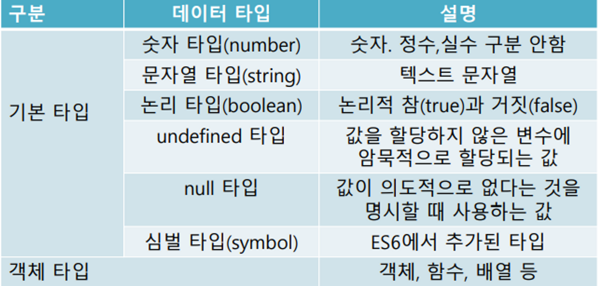

# 코드구조
## 표현식
- 값으로 평가될수 있는 문
- 컴퓨터 메모리에 값이 저장됨.
- 표현식의 종류에는 리터럴 ,식별자,연산자, 함수호출 표현식이 있음.

## 리터럴
- 리터럴은 사람이 이해할 수 있는 문자 또는 약속된 기호를 사용 해 값을 생성하는 표기법


## 값
- 표현식이 평가되어 생성된 결과
- 모든값은 데이터 타입을 가지며 메모리에 2진수 비트로 나열됨.

## ★ ASI 
-엔진 자체적으로 문의 끝 지점에 세미콜론을 넣어주는 세미 콜론 자동삽입 기능
- 하지만 ASI기능이 잘못 삽입하는 경우도 발생하므로 항상 붙이는 것을 권장
- ★ 단, 문들을 <br>중괄호로 묶은 코드 블록({ … })</br> 뒤에는 세미콜론을 붙이지 않음.

# 변수와 상수
## 변수
- 변수 선언
`let 변수이름=값;`
- 재할당
`변수이름=값;`
- 변수 콘솔창 출력
`console.log(변수);`

### var
- var : 예전에 변수 선언시 썼던것 -> 권장하지 않음
`var a=10;`

```js
//사용 예시
let userName='뽀로로';
userName='루피';
```

## 상수
- 불변의 데이터,재할당이 불가함.
- `const`로 선언.
- 대문자와 밑줄로 구성된 이름으로 명명함.

```js
const SALERATE =0.2;
```

## ★이름 관례(convention)★

- 식별자: 데이터를 구분하기 위한 고유 이름(변수, 함수..)
0. naming convention : 이름 규칙
- camel case 사용하기!
    - 첫글자소문자, 그다음 단어 시작을 대문자로
var userPhoneNumber = 1;   // camel case (자바, 자바스크립트 선호)

var user_phone_number = 1; // snake case (파이썬, SQL 선호)
var UserPhoneNumber = 1;   // pascal case (C계열)

1. 대소문자를 구분할 것!
```js
var banana = '바나나';
var Banana = '뻐네너';
var BaNaNa = '버네이너으';
```

2. 숫자로 시작하거나 숫자만으로 만들면 안됨!
```js
var 800 = '메롱';
var 70apple = '사과';
var number7 = 7;
var app99le = 99;
```

3. 특수문자는 $, _ 외 사용불가
```js
var hi! = '안녕';
var $bye = '잘가';
var my_friend = '둘리';
```

4. 띄어쓰기 불가능
```js
var user phone number = '01012344321';
var userphonenumber = '01099993333';
```

5. 키워드(예약어)는 이름으로 쓰지 말것!
```js
var var = 1;
var if = 1;
var break = 1;
```

6. 식별자 이름은 구체적이고 명확하고 일관성있게 지을 것!
```js    
var a = '홍길동';   // -> userName
var zzzz = 'abc1234@gmail.com';  //-> userEmail
var fzd = '남자'  // -> userGender
```

# 자료형
## 동적타입 언어
- 자료의 타입은 있지만 변수에 저장되는 값의 타입을 언제든지 바꿀 수 있는 언너
## 자료형의 종류

### 기본 타입
1. number
- 정수 와 실수 구분이 없으며 연산시 모두 실수로 처리함.
```js
let num1=0;
let num2=9.9;
console.log(typeof num1);
console.log(typeof num2);
console.log(5/2);
```
- `NaN` :계산중 에러가 발생을 뜻하는 값.

2. string
- 문자열 표기법
- ★백틱` (``) ` : 템플릿 리터럴이 가능하고 변수와 문자열 결합이 가능하여 간편하게 처리 가능해 사용 권장함.
- 홑따옴표('')
- 겹따옴표("")

```js
let userName='뽀로로';
let userAge=5;
console.log(`제이름은 ${userName}이구요 나이는 ${userAge}`);
```
3. boolean
- true,false

4. null
- 고의적으로 값이 없음을 표현할때 사용.
- 존재하지 않는(nothing)’ 값, ‘비어 있는(empty)’ 값, ‘알 수 없는(unknown)’ 값을 나타내는 데 사용

5. undefined 
-'값이 할당되지 않은 상태’를 나타낼 때 사용
- 변수 만들고 값 안 넣어둔 상태(실수)

```js
let address;
console.log(address);

let w='충남 청양군 읍내리';
w=null;//값이 없음을 알릴때,

```

## typeof
- 변수의 자료형을 알수 있는 연산자

```js
let num=10;
console.log(num); //number출력
```


